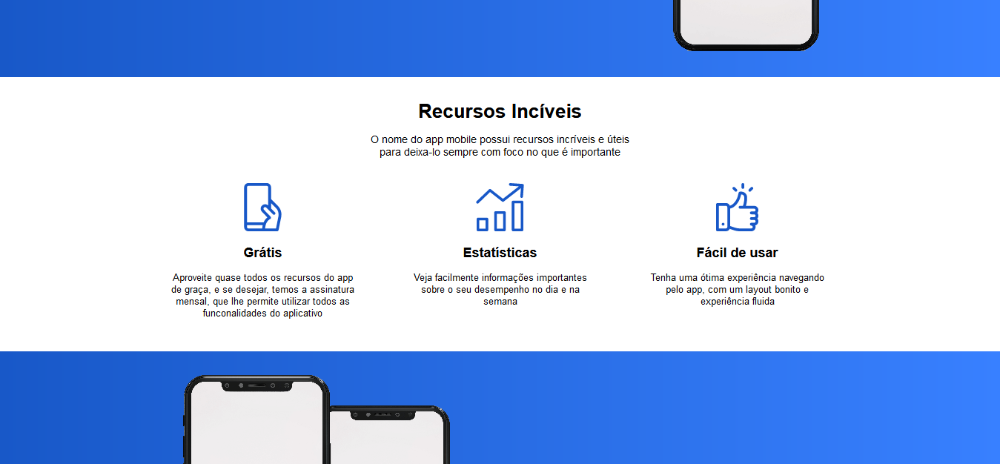
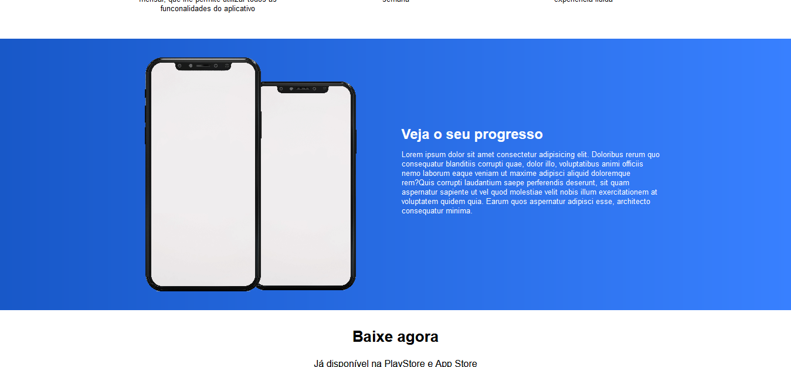
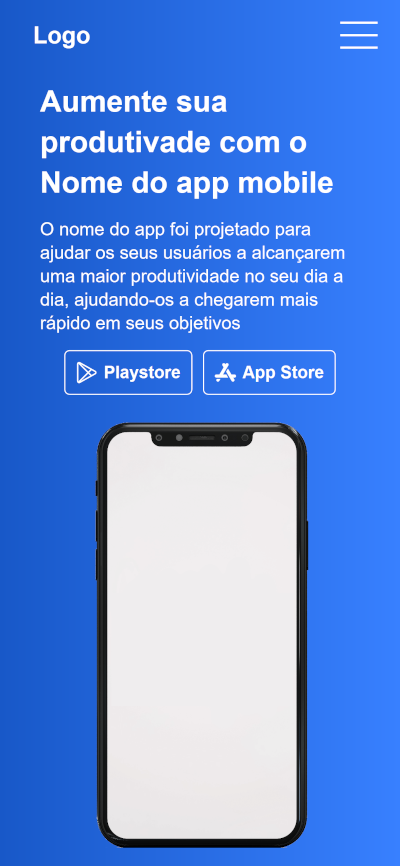
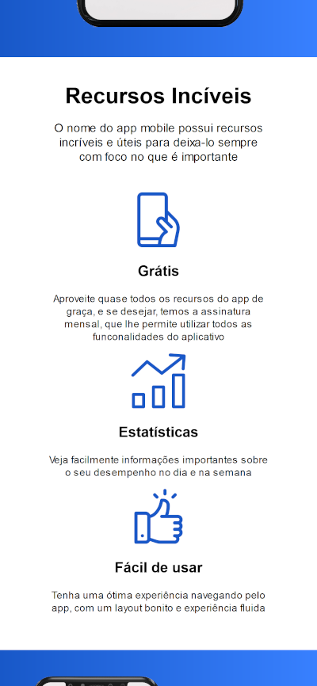
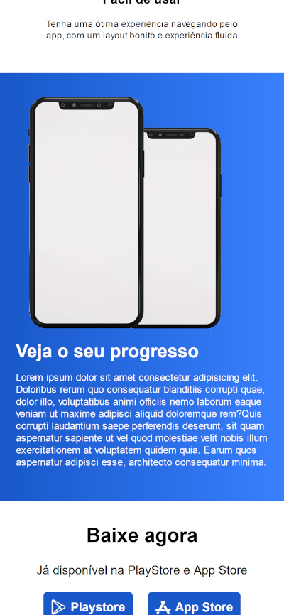
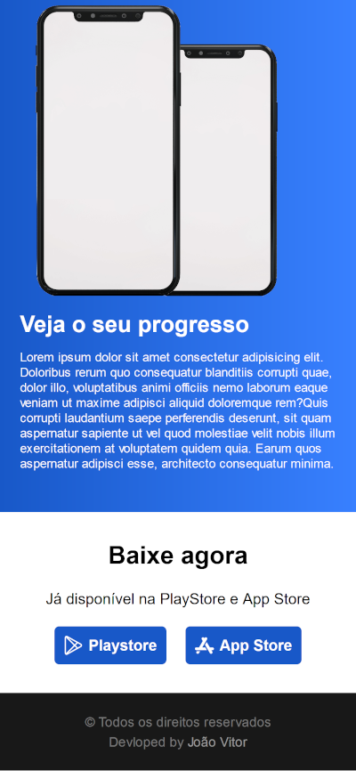

# Landing page de app mobile

Landing page simples de um aplicativo mobile fictício

# Tabela de conteúdos

* [Demonstração do site](#gear-Demonstração-do-site)
* [Tecnologias](#computer-Tecnologias)
* [Licensa](#page_facing_up-Licensa)

# :gear: Demonstração do site

Acesse o site aqui: https://jvuser01.github.io/landing-page-mobile-app/

## Desktop screenshots

    
    
    
    

## Mobile screenshots

    
    
    
    

# :computer: Tecnologias

Este projeto foi desenvolvido utilizando as seguintes tecnologias:

* HTML5
* CSS3

# :page_facing_up: Licensa

Desenvolvido por [João Vitor](https://github.com/JVUser01) :rocket:. Esse projeto está sob a [licença MIT](LICENSE.txt).